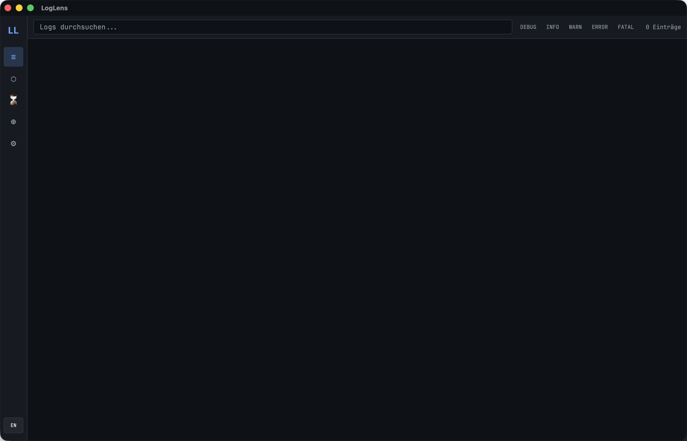

<div align="center">


# LogLens

</div>

**Macht aus 500 Kopien desselben Fehlers eine Zeile, damit das Log wieder lesbar wird.**

Ein fehlschlagender Request, der in einer Schleife wiederholt wird, füllt das
Log mit hunderten identischen Stacktraces. Da durchzuscrollen ist keine
Analyse, sondern die Suche nach der einen abweichenden Zeile zwischen den
Wiederholungen.

LogLens bildet Fingerabdrücke von Fehlern und klappt die Duplikate zusammen,
sodass eine Datei mit 500 Einträgen die Handvoll unterschiedlicher Probleme
zeigt, die tatsächlich drinstecken. Zeig auf eine Logdatei oder einen
Docker-Container und such live darüber.

Was sich nicht auf einen Blick lesen lässt, erklärt dir ein Modell samt
Lösungsvorschlag: Claude mit API-Key, oder ein lokales Ollama-Modell.

**Nichts für dich, wenn** du gemeldet bekommen willst, während es passiert.
Das hier ist für ein Log, mit dem du dich hinsetzt;
[BugRadar](https://github.com/9t29zhmwdh-coder/BugRadar) ist das, was zuschaut
und Auffälligkeiten meldet, sobald sie auftreten.

[](https://github.com/9t29zhmwdh-coder/LogLens/actions) [](https://github.com/9t29zhmwdh-coder/LogLens/security/code-scanning) [](https://securityscorecards.dev/viewer/?uri=github.com/9t29zhmwdh-coder/LogLens) [](https://www.bestpractices.dev/projects/13698)

     

[🇬🇧 English Version](README.md)

> **So läuft es:** LogLens ist eine native Desktop-App, kein Server oder Browser-Tool. Sie öffnet sich als eigenes Fenster, ohne Tray-Icon oder Hintergrunddienst; sie überwacht Quellen und analysiert Logs nur, während das Fenster geöffnet ist.



---

> 💾 **Download:** [macOS (DMG)](https://github.com/9t29zhmwdh-coder/LogLens/releases/latest/download/LogLens.dmg) · [Windows (Installer)](https://github.com/9t29zhmwdh-coder/LogLens/releases/latest/download/LogLens-Setup.exe) · [Linux (AppImage)](https://github.com/9t29zhmwdh-coder/LogLens/releases/latest/download/LogLens.AppImage): immer das neueste Release, nicht signiert/notarisiert (Gatekeeper/SmartScreen warnen beim ersten Start). .deb/.rpm-Pakete gibt es auch auf der [Releases-Seite](https://github.com/9t29zhmwdh-coder/LogLens/releases). Oder selbst aus dem Quellcode bauen, siehe Erste Schritte unten.

---

> 🌱 Neu hier? → [Schritt-für-Schritt-Anleitung für Einsteiger](GETTING_STARTED.md)

---

Die Oberfläche von LogLens ist auf Englisch (Standard) und Deutsch verfügbar, umschaltbar über den Sprachtoggle.

**In der Praxis:** du zeigst LogLens auf eine Logdatei oder einen Docker-Container, es clustert wiederkehrende Fehler per Fingerprint, sodass du 1 Eintrag statt 500 Duplikaten siehst, und lässt auf Wunsch Claude (Standard) oder ein lokales Ollama-Modell die Ursache mit konkreten Lösungsschritten erklären.

## Übersicht

LogLens ist ein plattformübergreifendes Entwicklerwerkzeug, das **Logs aus beliebigen Quellen sammelt, normalisiert, clustert und erklärt**; lokale Dateien, Docker-Container und Systemlogs. Die Kombination aus Volltextsuche und KI-generierten Erklärungen (Claude oder Ollama) reduziert die Fehlersuche von Stunden auf Minuten.

## Funktionen

| Modul | Beschreibung |
|---|---|
| **Multi-Source-Collector** | Dateien, Verzeichnisse (Glob), Docker-Container & Services, macOS Unified Logging, journald, Windows EventLog, stdin |
| **Formaterkennung** | JSON, Plaintext, key=value, Nginx Combined, Docker JSON-File, Syslog: automatisch erkannt |
| **Eigene Parser** | Eigenes Format über eine Regex-Vorlage mit benannten Capture-Groups definieren, einer Quelle unter Einstellungen → Eigene Parser zuweisen |
| **Stacktrace-Zusammenführung** | Mehrzeilige Stacktraces (Rust, Java, Python, JS) werden automatisch zu einem Eintrag zusammengefasst |
| **Fehler-Clustering** | Fingerprinting entfernt UUIDs, IPs, Zeitstempel → gruppiert ähnliche Fehler per Similarity-Matching |
| **FTS5-Volltextsuche** | SQLite FTS5 mit Ranking, Phrasensuche und Operatoren |
| **KI-Erklärung** | Pro Eintrag: Was ist passiert, warum, wie beheben: via Claude oder Ollama |
| **KI-Block-Zusammenfassung** | Zeitfenster zusammenfassen: Überblick, Hauptprobleme, Ursachen, Empfehlungen |
| **Root-Cause-Analyse** | Cluster-Tiefenanalyse: Einflussfaktoren, nummerierte Fix-Schritte mit Befehlen |
| **Timeline** | Gestapeltes Flächendiagramm für Fehler/Warnungen: Spike-Erkennung integriert |
| **Export** | JSON- und Markdown-Export |
| **CLI** | `loglens watch`, `search`, `clusters`, `analyze`, `export` |

## Voraussetzungen

- **Rust** (Stable-Toolchain): Installation via [rustup](https://rustup.rs)
- **Node.js 20** (LTS empfohlen) mit npm: für den Build des `frontend/`-Verzeichnisses (React + TypeScript)
- **Tauri CLI** (`cargo tauri`): Installation mit `cargo install tauri-cli`, nötig zum Ausführen/Bauen der Desktop-App
- Ein unterstütztes Betriebssystem: macOS, Windows oder Ubuntu/Linux (siehe CI-Badge oben)
- Das `loglens`-CLI-Binary (`crates/ll-cli`) wird mit reinem `cargo build`/`cargo install` gebaut, ohne Node-/Tauri-Abhängigkeit
- Ein [Anthropic API-Key](https://console.anthropic.com/) (Standard) oder lokal laufendes [Ollama](https://ollama.ai) (optional, für KI-Erklärung/Root-Cause; Suche, Clustering und Export funktionieren auch ohne)

## Schnellstart

```bash
# Desktop-App
cargo tauri dev

# CLI: Datei beobachten
loglens watch /var/log/app.log --level warn

# CLI: Docker-Container + KI-Erklärung
loglens watch docker://my-api --ai

# CLI: Suche
loglens search "connection refused"

# CLI: Top-Fehler-Cluster anzeigen
loglens clusters --top 20

# CLI: KI Root-Cause für einen Cluster
loglens analyze <cluster-id>

# API-Key setzen (in System-Keychain gespeichert)
loglens config set-key sk-ant-...
```

## Architektur

```
LogLens
├── crates/ll-core/          # Kernbibliothek
│   ├── collector/           # Datei-, Docker- und Systemlog-Collector
│   ├── normalizer/          # Formaterkennung + Zeile → NormalizedEntry
│   ├── clustering/          # Fingerprinting + Similarity-Grouper
│   ├── query/               # FTS5-Query-Engine + KI-Übersetzung
│   ├── timeline/            # Spike-Erkennung + Service-Korrelation
│   ├── ai/                  # Claude + Ollama (erklären / zusammenfassen / Root-Cause)
│   ├── export/              # JSON + Markdown Export
│   └── db/                  # SQLite mit FTS5-Migrationen
├── crates/ll-cli/           # CLI-Binary
├── src-tauri/               # Tauri-Backend + IPC-Commands
└── frontend/                # React + TypeScript + Recharts Dashboard
```

## Tech-Stack

| Schicht | Technologie |
|---|---|
| Core | Rust async (Tokio) |
| Desktop | Tauri v2 |
| Frontend | React 18 + TypeScript + Tailwind + Recharts |
| State | Zustand |
| Datenbank | SQLite mit FTS5 |
| Datei-Watching | notify + notify-debouncer-full |
| Docker | bollard |
| Clustering | sha2-Fingerprinting + strsim-Similarity |
| KI | Claude (`claude-haiku-4-5`) + Ollama |
| API-Keys | System-Keychain (keyring) |

## Konfiguration

Alle Einstellungen werden gespeichert unter `~/Library/Application Support/ch.raystudio.loglens/` (macOS), `~/.local/share/loglens/` (Linux) oder `%APPDATA%\loglens\` (Windows).

Der API-Key wird ausschliesslich im **System-Keychain** gespeichert, niemals als Klartext.

## Eigene Parser

Wenn ein Log-Format zu keinem eingebauten Parser passt (JSON, key=value, Nginx, Docker, Syslog), definiere einen eigenen unter Einstellungen → Eigene Parser: ein Name und eine Regex mit benannten Capture-Groups. Erkannte Groups (alle optional):

| Group | Verwendet für | Fallback |
|---|---|---|
| `timestamp` | Zeitpunkt des Eintrags | aktuelle Zeit |
| `level` | Log-Level (`error`, `warn`, ...) | `Unknown` |
| `service` | Service-/Komponentenname | `None` |
| `message` | Der Eintragstext | die ganze Zeile |

```
^(?<timestamp>\S+) \[(?<level>\w+)\] (?<service>[\w-]+): (?<message>.*)$
```

matcht `2026-07-13T10:00:00Z [ERROR] billing-svc: charge declined`. Standardmässig wird die `timestamp`-Group als RFC 3339 geparst; für andere Formate ein chrono-strftime-Muster (z. B. `%Y/%m/%d %H:%M:%S`) im Zeitstempel-Format-Feld der Vorlage angeben. Der Parser wird einer Quelle über das Dropdown unter Log-Quellen zugewiesen; eine Zeile, die nicht zur Regex passt, fällt auf die automatische Erkennung zurück, sodass ein eigener Parser nie stillschweigend Zeilen verwirft.

## Deinstallation / Aufräumen

- App-Bundle löschen
- Das oben genannte Datenverzeichnis entfernen (`loglens.db` und Einstellungen)
- Gespeicherten API-Key aus der Schlüsselbundverwaltung.app entfernen (suche nach "loglens" oder "LogLens")

Es bleiben keine weiteren Dateien oder Hintergrunddienste zurück.

---

**Autor:** [Rafael Yilmaz](https://github.com/9t29zhmwdh-coder) · **Status:** Active ·  · **Lizenz:** MIT
