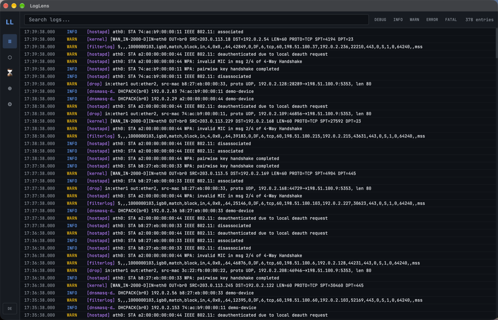
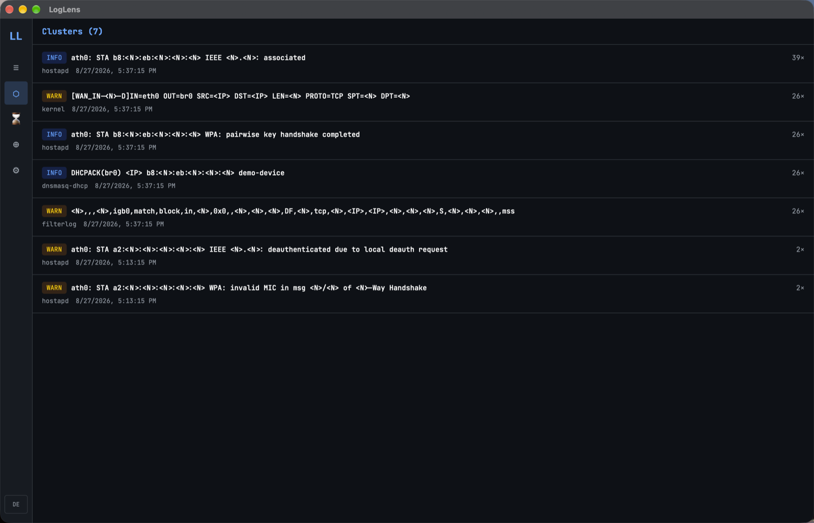

<div align="center">
  
  <h1>LogLens</h1>
</div>

[🇩🇪 Deutsche Version](README.de.md)

**Turns 500 copies of the same error into one line, so the log becomes readable again.**

One failing request retried in a loop fills a log with hundreds of identical
stack traces. Scrolling through them is not analysis, it is looking for the
one different line hidden between the repeats.

LogLens fingerprints errors and collapses the duplicates, so a file with 500
entries shows the handful of distinct problems it actually contains. Point it
at a log file or a Docker container and search across it live.

For anything you cannot read at a glance, a model explains the cluster and
suggests a fix: Claude with an API key, or a local Ollama model.

**Not for you if** you want to be told while it is happening. This is for a
log you sit down with; [BugRadar](https://github.com/9t29zhmwdh-coder/BugRadar)
is the one that watches and flags anomalies as they occur.

[](https://github.com/9t29zhmwdh-coder/LogLens/actions) [](https://github.com/9t29zhmwdh-coder/LogLens/security/code-scanning) [](https://securityscorecards.dev/viewer/?uri=github.com/9t29zhmwdh-coder/LogLens) [](https://www.bestpractices.dev/projects/13698)

     

> **How it runs:** LogLens is a native desktop app, not a server or browser tool. It opens as its own window and has no tray icon or background service; it only watches sources and analyzes logs while the window is open.


---

> 💾 **Download:** [macOS (DMG)](https://github.com/9t29zhmwdh-coder/LogLens/releases/latest/download/LogLens.dmg) · [Windows (Installer)](https://github.com/9t29zhmwdh-coder/LogLens/releases/latest/download/LogLens-Setup.exe) · [Linux (AppImage)](https://github.com/9t29zhmwdh-coder/LogLens/releases/latest/download/LogLens.AppImage): always the latest release, not code-signed/notarized (Gatekeeper/SmartScreen will warn on first run). .deb/.rpm packages also available on the [Releases page](https://github.com/9t29zhmwdh-coder/LogLens/releases). Or build from source, see Getting Started below.

---

> 🌱 New here? → [Step-by-step guide for beginners](GETTING_STARTED.md)

---

LogLens's UI is available in English (default) and German; switch anytime with the language toggle.

**In practice:** you point LogLens at a log file, a Docker container or a syslog listener, it clusters recurring errors by fingerprint so you see 1 entry instead of 500 duplicates, and on request asks Claude (default), Azure OpenAI or a local Ollama model to explain the root cause with concrete fix steps.

## Overview

LogLens is a cross-platform developer tool that **collects, normalizes, clusters and explains logs** from any source; local files, Docker containers and system logs. It combines full-text search with AI-generated explanations (Claude by default, or a local Ollama model) to reduce triage time from hours to minutes.

## Network logs

Point a firewall, gateway or access point at LogLens and it reads what they
say, rather than showing you the line and leaving the reading to you.



```
$ python3 examples/send-demo-syslog.py    # synthetic sample stream

  wifi_auth_failure   a2:00:00:00:00:44 on ap-lab, ath0, invalid_psk   x12
  firewall_blocked    203.0.113.x to 192.0.2.14:3389, WAN_IN-2000-D     x8
  dhcp_lease_granted  74:ac:b9:00:00:11 got 192.0.2.87 on br0
```

Twelve failed handshakes from one client is a device with a stale WiFi
password, not twelve unrelated warnings. The classifier gives every one of
them the same event type, so the cluster view groups them and the AI
explanation gets the client, the access point and the radio as facts rather
than as text to guess from.



| Source | Formats read |
|---|---|
| UniFi / UISP | hostapd association and WPA handshakes, dnsmasq DHCP, netfilter rules with the UniFi rule name |
| pfSense / OPNsense | `filterlog` positional CSV, IPv4 and IPv6, with the full five-tuple |
| Mikrotik RouterOS | topic-prefixed firewall, wireless and DHCP lines |
| Anything else | Any RFC 5424 or RFC 3164 sender, indexed and searchable even when no classifier recognizes it |

**Setting it up.** Add a listener under Sources, then point the appliance at
it. In UniFi that is Settings, System, Remote Syslog Server. The default
port is 5514 rather than 514, so the application never needs root; forward
514 to it if the sender cannot be changed.

**Before you rely on it.** The syslog layer is tested against the examples
in RFC 5424 and RFC 3164 themselves. The vendor patterns are built from
published log samples and from the upstream projects the wording comes from,
and have not yet been replayed against a live controller. Unrecognized lines
are kept and indexed, never silently dropped, so a gap shows up as an
unclassified entry rather than as missing data.

**What leaves your machine.** Nothing, with the default local backend.
Network logs carry MAC addresses, internal addresses and host names, so
choosing a hosted model means those reach that provider. See
[ARCHITECTURE.md](ARCHITECTURE.md#security).

---

## Features

| Module | What it does |
|---|---|
| **Multi-source collector** | Files, directories (glob), Docker containers & services, macOS Unified Logging, journald, Windows EventLog, syslog listener, stdin |
| **Network log analysis** | A syslog listener (RFC 5424 and RFC 3164) that classifies UniFi, pfSense, OPNsense and RouterOS lines into typed events with the MAC, address, port and rule extracted |
| **Format detection** | JSON, plaintext, key=value, Nginx combined, Docker JSON-file, syslog: auto-detected |
| **Custom parsers** | Define your own format via a regex template with named capture groups, assign it to a source in Settings → Custom Parsers |
| **Stacktrace merging** | Multi-line stacktraces (Rust, Java, Python, JS) are automatically combined into a single entry |
| **Error clustering** | Fingerprinting strips UUIDs, IPs, timestamps → groups similar errors with similarity matching |
| **FTS5 full-text search** | SQLite FTS5 with ranked search, phrase queries and operator support |
| **AI explain** | Per-entry explanation: what happened, why, how to fix: powered by Claude (default) or Ollama |
| **AI block summary** | Summarize a time window: overview, key issues, root causes, recommendations |
| **Root-cause analysis** | Cluster-level deep dive: contributing factors, numbered fix steps with commands |
| **Timeline** | Stacked area chart of errors/warnings per minute: spike detection built in |
| **Export** | JSON and Markdown export |
| **CLI** | `loglens watch`, `search`, `clusters`, `analyze`, `export` |

## Requirements

- **Rust** (stable toolchain): install via [rustup](https://rustup.rs)
- **Node.js 20** (LTS recommended) with npm: for building the `frontend/` (React + TypeScript) UI
- **Tauri CLI** (`cargo tauri`): install with `cargo install tauri-cli`, required to run/build the desktop app
- A supported OS: macOS, Windows or Ubuntu/Linux (see the CI badge above)
- The `loglens` CLI binary (`crates/ll-cli`) is built with plain `cargo build`/`cargo install` and has no Node/Tauri dependency
- An [Anthropic API key](https://console.anthropic.com/) (default) or [Ollama](https://ollama.ai) running locally (optional, for AI explain/root-cause; search, clustering and export work without either)

## Quick Start

```bash
# Desktop app
cargo tauri dev

# CLI: tail a file
loglens watch /var/log/app.log --level warn

# CLI: tail Docker container + AI explain
loglens watch docker://my-api --ai

# CLI: search
loglens search "connection refused"

# CLI: show top error clusters
loglens clusters --top 20

# CLI: AI root-cause on a cluster
loglens analyze <cluster-id>

# Set API key (stored in system keychain)
loglens config set-key sk-ant-...
```

## Architecture

```
LogLens
├── crates/ll-core/          # Core library
│   ├── collector/           # File, Docker, system log collectors
│   ├── normalizer/          # Format detection + line → NormalizedEntry
│   ├── clustering/          # Fingerprinting + similarity grouper
│   ├── query/               # FTS5 query engine + AI natural-language translation
│   ├── timeline/            # Spike detection + service correlation
│   ├── ai/                  # Claude + Ollama backends (explain / summarize / root-cause)
│   ├── export/              # JSON + Markdown export
│   └── db/                  # SQLite with FTS5 migrations
├── crates/ll-cli/           # CLI binary
├── src-tauri/               # Tauri backend + IPC commands
└── frontend/                # React + TypeScript + Recharts dashboard
```

## Tech Stack

| Layer | Technology |
|---|---|
| Core | Rust async (Tokio) |
| Desktop | Tauri v2 |
| Frontend | React 18 + TypeScript + Tailwind + Recharts |
| State | Zustand |
| Database | SQLite with FTS5 |
| File watching | notify + notify-debouncer-full |
| Docker | bollard |
| Clustering | sha2 fingerprinting + strsim similarity |
| AI | Claude (Anthropic API, default) or Ollama (local) |
| API keys | System keychain (keyring) |

## Configuration

All settings are stored in `~/.local/share/loglens/` (Linux), `~/Library/Application Support/ch.raystudio.loglens/` (macOS) or `%APPDATA%\loglens\` (Windows).

AI credentials are stored in the **system keychain**, never in plain text files.

## Custom Parsers

When a log format doesn't match any built-in parser (JSON, key=value, Nginx, Docker, syslog), define your own in Settings → Custom Parsers: a name and a regex with named capture groups. Recognized groups (all optional):

| Group | Used for | Falls back to |
|---|---|---|
| `timestamp` | Entry time | current time |
| `level` | Log level (`error`, `warn`, ...) | `Unknown` |
| `service` | Service/component name | `None` |
| `message` | The entry text | the whole line |

```
^(?<timestamp>\S+) \[(?<level>\w+)\] (?<service>[\w-]+): (?<message>.*)$
```

matches `2026-07-13T10:00:00Z [ERROR] billing-svc: charge declined`. By default the `timestamp` group is parsed as RFC 3339; set a chrono strftime pattern (e.g. `%Y/%m/%d %H:%M:%S`) in the template's timestamp format field for other formats. Assign the parser to a source via the dropdown in Log Sources; a line that doesn't match the regex falls back to auto-detection, so a custom parser can never silently drop lines.

## Uninstall / Cleanup

- Delete the app bundle
- Remove the data directory listed under Configuration above (`loglens.db` and settings)
- Remove the stored API key from Keychain Access.app (search for "loglens" or "LogLens")

No other files or background services are left behind.

---

**Author:** [Rafael Yilmaz](https://github.com/9t29zhmwdh-coder) · **Status:** Active ·  · **License:** MIT
