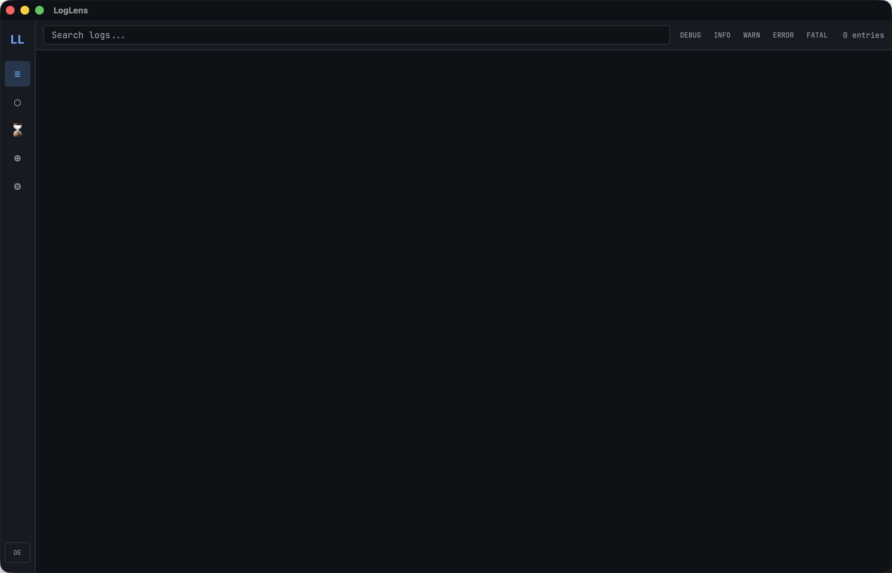

<div align="center">
  
  <h1>LogLens</h1>
</div>

[🇩🇪 Deutsche Version](README.de.md)

**AI-powered log analysis · Real-time search · Error clustering · Root-cause reports**

[](https://github.com/9t29zhmwdh-coder/LogLens/actions)      

> **How it runs:** LogLens is a native desktop app, not a server or browser tool. It opens as its own window and has no tray icon or background service; it only watches sources and analyzes logs while the window is open.



---

> 💾 **Download:** [macOS (DMG)](https://github.com/9t29zhmwdh-coder/LogLens/releases/latest/download/LogLens.dmg) · [Windows (Installer)](https://github.com/9t29zhmwdh-coder/LogLens/releases/latest/download/LogLens-Setup.exe) · [Linux (AppImage)](https://github.com/9t29zhmwdh-coder/LogLens/releases/latest/download/LogLens.AppImage) — always the latest release, not code-signed/notarized (Gatekeeper/SmartScreen will warn on first run). .deb/.rpm packages also available on the [Releases page](https://github.com/9t29zhmwdh-coder/LogLens/releases). Or build from source, see Getting Started below.

---

> 🌱 New here? → [Step-by-step guide for beginners](GETTING_STARTED.md)

---

LogLens's UI is available in English (default) and German; switch anytime with the language toggle.

**In practice:** you point LogLens at a log file or Docker container, it clusters recurring errors by fingerprint so you see 1 entry instead of 500 duplicates, and on request asks Claude (default) or a local Ollama model to explain the root cause with concrete fix steps.

## Overview

LogLens is a cross-platform developer tool that **collects, normalizes, clusters and explains logs** from any source; local files, Docker containers and system logs. It combines full-text search with AI-generated explanations (Claude by default, or a local Ollama model) to reduce triage time from hours to minutes.

## Features

| Module | What it does |
|---|---|
| **Multi-source collector** | Files, directories (glob), Docker containers & services, macOS Unified Logging, journald, Windows EventLog, stdin |
| **Format detection** | JSON, plaintext, key=value, Nginx combined, Docker JSON-file, syslog: auto-detected |
| **Stacktrace merging** | Multi-line stacktraces (Rust, Java, Python, JS) are automatically combined into a single entry |
| **Error clustering** | Fingerprinting strips UUIDs, IPs, timestamps → groups similar errors with similarity matching |
| **FTS5 full-text search** | SQLite FTS5 with ranked search, phrase queries and operator support |
| **AI explain** | Per-entry explanation: what happened, why, how to fix: powered by Claude (default) or Ollama |
| **AI block summary** | Summarize a time window: overview, key issues, root causes, recommendations |
| **Root-cause analysis** | Cluster-level deep dive: contributing factors, numbered fix steps with commands |
| **Timeline** | Stacked area chart of errors/warnings per minute: spike detection built in |
| **Export** | JSON and Markdown export |
| **CLI** | `loglens watch`, `search`, `clusters`, `analyze`, `export` |

## Requirements

- **Rust** (stable toolchain) — install via [rustup](https://rustup.rs)
- **Node.js 20** (LTS recommended) with npm — for building the `frontend/` (React + TypeScript) UI
- **Tauri CLI** (`cargo tauri`) — install with `cargo install tauri-cli`, required to run/build the desktop app
- A supported OS: macOS, Windows or Ubuntu/Linux (see the CI badge above)
- The `loglens` CLI binary (`crates/ll-cli`) is built with plain `cargo build`/`cargo install` and has no Node/Tauri dependency

## Quick Start

```bash
# Desktop app
cargo tauri dev

# CLI: tail a file
loglens watch /var/log/app.log --level warn

# CLI: tail Docker container + AI explain
loglens watch docker://my-api --ai

# CLI: search
loglens search "connection refused"

# CLI: show top error clusters
loglens clusters --top 20

# CLI: AI root-cause on a cluster
loglens analyze <cluster-id>

# Set API key (stored in system keychain)
loglens config set-key sk-ant-...
```

## Architecture

```
LogLens
├── crates/ll-core/          # Core library
│   ├── collector/           # File, Docker, system log collectors
│   ├── normalizer/          # Format detection + line → NormalizedEntry
│   ├── clustering/          # Fingerprinting + similarity grouper
│   ├── query/               # FTS5 query engine + AI natural-language translation
│   ├── timeline/            # Spike detection + service correlation
│   ├── ai/                  # Claude + Ollama backends (explain / summarize / root-cause)
│   ├── export/              # JSON + Markdown export
│   └── db/                  # SQLite with FTS5 migrations
├── crates/ll-cli/           # CLI binary
├── src-tauri/               # Tauri backend + IPC commands
└── frontend/                # React + TypeScript + Recharts dashboard
```

## Tech Stack

| Layer | Technology |
|---|---|
| Core | Rust async (Tokio) |
| Desktop | Tauri v2 |
| Frontend | React 18 + TypeScript + Tailwind + Recharts |
| State | Zustand |
| Database | SQLite with FTS5 |
| File watching | notify + notify-debouncer-full |
| Docker | bollard |
| Clustering | sha2 fingerprinting + strsim similarity |
| AI | Claude (Anthropic API, default) or Ollama (local) |
| API keys | System keychain (keyring) |

## Configuration

All settings are stored in `~/.local/share/loglens/` (Linux), `~/Library/Application Support/ch.raystudio.loglens/` (macOS) or `%APPDATA%\loglens\` (Windows).

AI credentials are stored in the **system keychain**, never in plain text files.

## Uninstall / Cleanup

- Delete the app bundle
- Remove the data directory listed under Configuration above (`loglens.db` and settings)
- Remove the stored API key from Keychain Access.app (search for "loglens" or "LogLens")

No other files or background services are left behind.

---

**Author:** [Rafael Yilmaz](https://github.com/9t29zhmwdh-coder) · **Status:** Active ·  · **License:** MIT
